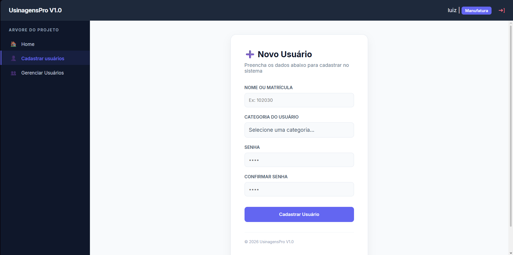

# Programação de Funcionalidades

### Tela de Cadastro (RF-01, RF-06)

Responsável: Kaique Silveira

A tela de cadastro pode ser acessada na opção de menu "Cadastrar usuários"

#### Requisito atendido

<ul>
<li>RF-01: O sistema deve possibilitar o cadastro de novos colaboradores dos setores da produção e administração.</li>
<li>RF-06: O sistema deve possibilitar segregação de acesso a páginas de acordo com os perfis de usuários.</li>
</ul>

#### Artefatos da funcionalidade

<ul>
<li>principal.html</li>
<li>principal.css</li>
<li>principal.js</li>
<li>cadastrarUsuario_content.html</li>
</ul>

#### Instruções de acesso

O cadastro de usuário pode ser feito por um usuário do tipo "administrador" que tenha acesso ao sistema ao entrar no menu "Cadastrar usuários" na barra de navegação ao canto esquerdo da tela. O administrador escolhe a categoria do usuário criado.

> **Links Úteis**:
>
> - [Trabalhando com HTML5 Local Storage e JSON](https://www.devmedia.com.br/trabalhando-com-html5-local-storage-e-json/29045)
> - [JSON Tutorial](https://www.w3resource.com/JSON)
> - [JSON - Introduction (W3Schools)](https://www.w3schools.com/js/js_json_intro.asp)
> - [JSON Tutorial (TutorialsPoint)](https://www.tutorialspoint.com/json/index.htm)
