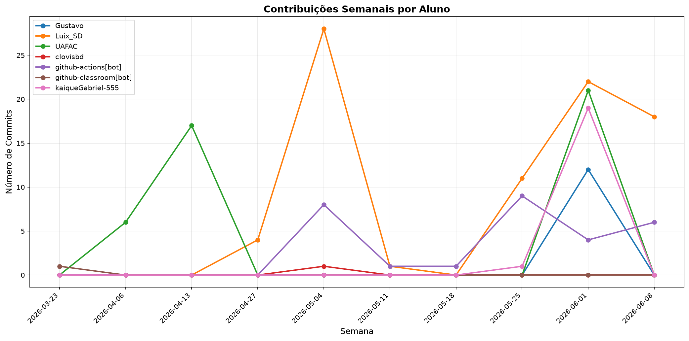

# 📊 Relatório de Contribuições do Projeto

**Última atualização:** 22/06/2026 05:07

---

## 📈 Resumo Geral de Contribuições

| Aluno                 |   Commits |   Linhas+ |   Linhas- |   Arquivos |   Docs Commits |   Docs Arquivos |
|-----------------------|-----------|-----------|-----------|------------|----------------|-----------------|
| Gustavo               |        12 |       582 |         0 |          8 |             12 |               3 |
| Luix_SD               |        84 |      4602 |      1753 |         70 |             23 |               3 |
| UAFAC                 |        44 |      7208 |      7561 |        102 |             29 |               3 |
| clovisbd              |         1 |         5 |         0 |          1 |              0 |               0 |
| github-actions[bot]   |        29 |       404 |       157 |          3 |             28 |               1 |
| github-classroom[bot] |         1 |       774 |         0 |         19 |              1 |               3 |
| kaiqueGabriel-555     |        20 |       564 |       276 |          8 |             19 |               2 |

## 📅 Contribuições Semanais (Todo o Semestre)

**2026-06-08**: Luix_SD: 18, github-actions[bot]: 6

**2026-06-01**: Gustavo: 12, Luix_SD: 22, UAFAC: 21, github-actions[bot]: 4, kaiqueGabriel-555: 19

**2026-05-25**: Luix_SD: 11, github-actions[bot]: 9, kaiqueGabriel-555: 1

**2026-05-18**: github-actions[bot]: 1

**2026-05-11**: Luix_SD: 1, github-actions[bot]: 1

**2026-05-04**: Luix_SD: 28, clovisbd: 1, github-actions[bot]: 8

**2026-04-27**: Luix_SD: 4

**2026-04-13**: UAFAC: 17

**2026-04-06**: UAFAC: 6

**2026-03-23**: github-classroom[bot]: 1

## 📊 Visualização Gráfica

## ℹ️ Observações

- **Commits**: Número total de commits realizados

- **Linhas+**: Linhas de código adicionadas

- **Linhas-**: Linhas de código removidas

- **Arquivos**: Número de arquivos únicos modificados

- **Docs Commits**: Commits em arquivos de documentação

- **Docs Arquivos**: Arquivos de documentação modificados

---

*Relatório gerado automaticamente via GitHub Actions*
